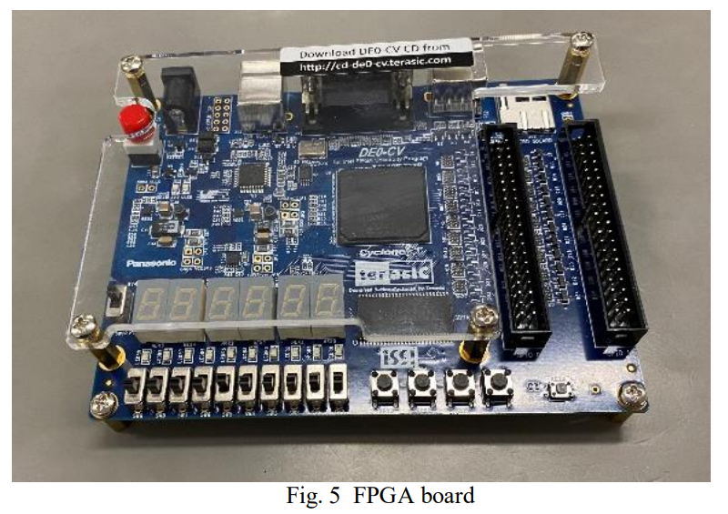
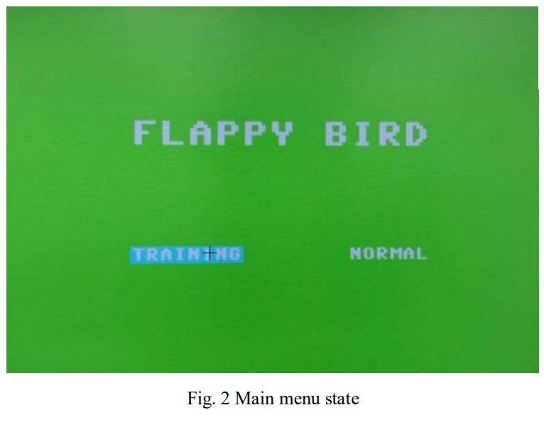
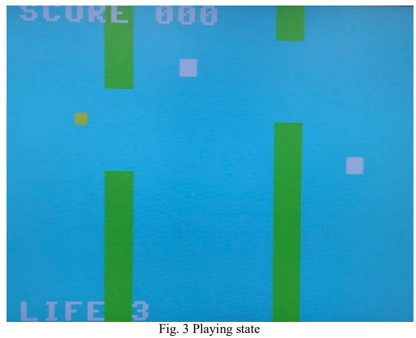
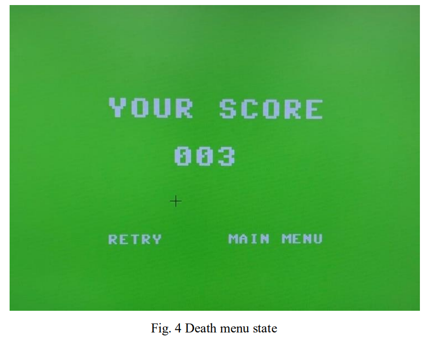
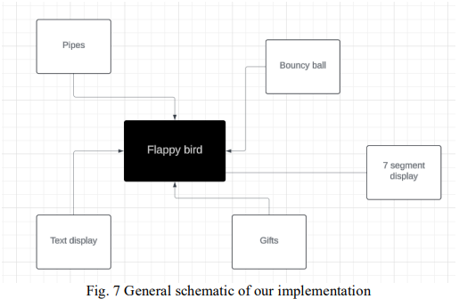
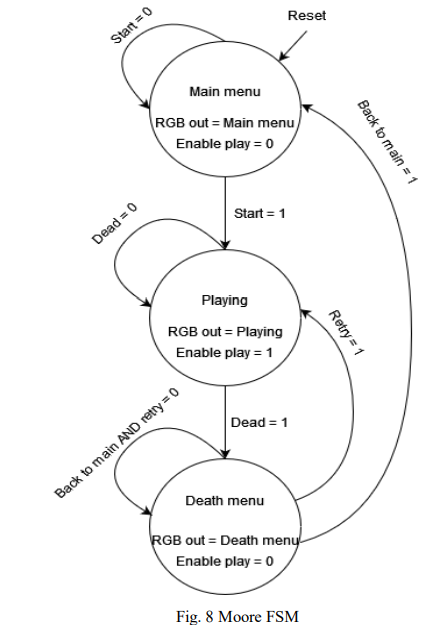
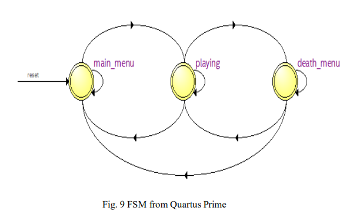

# Real-Time Game System Implementation on FPGA  
### Flappy Bird – Deterministic Hardware-Level Gameplay Architecture (VHDL)

---

# Project Overview

A fully playable **Flappy Bird** implementation running directly on a **Cyclone V (DE0-CV) FPGA** using **VHDL**, rendering graphics through **640×480 VGA output** with **PS/2 mouse input**.

Unlike typical engine-based game development, all gameplay systems — including state management, entity interaction, procedural variation, collision detection, and rendering control — are implemented directly in synchronous hardware logic.

This project focuses on **deterministic real-time gameplay systems** and demonstrates how common game architecture patterns can be implemented without a software game engine.

Key highlights:

- Moore FSM based game state architecture
- Modular entity system (bird, pipes, collectibles)
- Procedural gap generation using LFSR
- Frame-synchronized gameplay updates
- Hardware-constrained performance optimization

---

# Running on Hardware

The system runs on a **DE0-CV Cyclone V FPGA development board**, driving a VGA display and accepting PS/2 mouse input for gameplay interaction.

---

# Gameplay Screenshots

### Main Menu

The main menu allows players to select different gameplay modes using mouse input.

---

### Playing State

During gameplay the bird entity interacts with pipes and collectibles while score and life information are rendered through the text display system.

---

### Death Menu

When the player loses all lives, the game transitions to the death menu where the player can retry or return to the main menu.

---

# System Architecture

The system follows a **control-path / data-path architecture**.

A central gameplay module integrates the main subsystems:

- Bird entity controller
- Pipe obstacle system
- Collectible gift system
- LFSR random generator
- Text rendering module
- Seven-segment timer display

Each subsystem operates as an independent module connected through the top-level gameplay controller.

---

# Moore Finite State Machine

The gameplay flow is implemented as a **three-state Moore machine**:

Main states:

- Main Menu  
- Playing  
- Death Menu  

Transitions:

- Main Menu → Playing (mode selected)
- Playing → Death Menu (collision / life = 0)
- Death Menu → Retry or Main Menu

Separating state control from entity logic prevents unintended signal propagation.

---

# Quartus FSM Visualization

Quartus Prime synthesis tools were used to visualize and verify the FSM state transitions in hardware.

---

# Core Gameplay Systems

## Deterministic Frame-Based Updates

The FPGA operates at **50 MHz**, with gameplay updates synchronized to the display timing.

Instead of a traditional software game loop, motion and interactions are updated through synchronous logic tied to clock edges.

---

## Entity Recycling System

Three pipe entities and three gift entities are reused through a **recycling mechanism**.

When an entity exits the screen boundary, it is repositioned and reused, similar to **object pooling strategies used in game engines**.

---

## Procedural Variation (LFSR)

Pipe gap positions are generated using an **LFSR-based pseudo-random generator**.

The generator ensures that pipe gaps remain within a playable range while avoiding repetitive patterns.

---

## Collision & Invincibility System

Collision detection uses **area-overlap checks** between the bird entity and obstacles.

When a collision occurs:

- An invincibility timer activates
- The bird flashes visually
- Life reduction is temporarily gated

This improves gameplay fairness and feedback.

---

# Performance & Hardware Constraints

Timing analysis in **Quartus Prime** showed:

- Maximum achievable frequency: **11.72 MHz**
- Target refresh frequency: **25 MHz**

Sequential rendering logic within the menu modules introduced timing constraints.

Despite this, the system maintained an effective refresh rate of approximately **59.5 Hz**.

Resource usage:

- **3194 ALMs (~17%)**
- **817 registers**
- **<1% block memory**
- **0 DSP blocks**

---

# My Contributions

My primary focus was on **gameplay systems and control architecture**.

Key contributions:

- Designed and implemented the **Moore FSM game controller**
- Implemented the **pipe spawning and obstacle generation system**
- Developed the **LFSR-based pseudo-random gap generator**
- Integrated gameplay subsystems in the **top-level orchestration module**
- Implemented gameplay interaction logic and difficulty scaling
- Contributed to debugging and performance analysis during integration

---

# Lessons & Future Improvements

Potential improvements if the project were extended:

- Refactor menu rendering logic to improve timing performance
- Introduce sprite rendering pipelines
- Implement a pause state with gated clock domains
- Further decouple rendering and gameplay logic

---

# Relevance to Game Systems Programming

Although implemented entirely in hardware, this project explores architectural patterns common in modern game engines:

- Deterministic update loops
- State-driven gameplay flow
- Modular entity interaction
- Procedural content generation
- Performance-aware system design

Working at the hardware level provided deeper insight into how gameplay systems function beneath engine abstractions.
